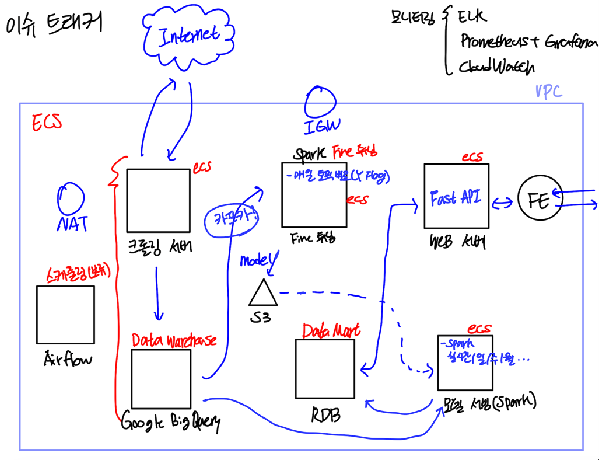
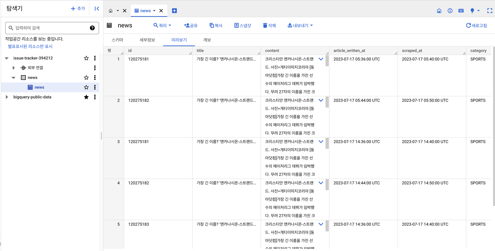
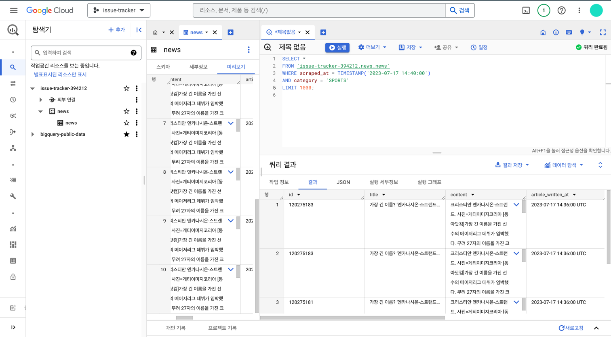
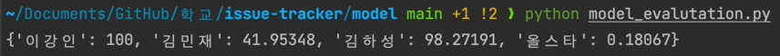

# 이슈 트래커 인프라
이슈트래커 프로젝트의 인프라 및 데이터 엔지니어링 환경 구성에 대한 레포지토리입니다.

## 프로젝트 구조
* 데이터 웨어하우스로 구글 빅쿼리를 사용합니다.
* 데이터 마트 및 웹 서비스 DB로 MySQL을 사용합니다.
* 대용량 데이터의 처리를 위해 스파크를 사용합니다.
* 아래 아키텍쳐는 러프한 디자인이며 기술 스택 등은 추후 변경될 수 있습니다.

## 구글 빅쿼리
* save_data_to_big_query_with_client.py
  * 구글 빅쿼리 클라이언트를 사용해 데이터를 저장하는 코드입니다.
* save_data_to_big_query.py
  * 스파크를 이용해 구글 빅쿼리에 데이터를 저장하는 코드입니다.
  * 데이터 저장에 스파크를 사용하는 것은 큰 의미가 없을 것 같아서 사용하지 않을 예정입니다.
* load_data_to_big_query.py
  * 빅쿼리에서 데이터를 가져와 spark로 처리하는 코드입니다.
  * 데이터 정제, 전처리, 모델 서빙, fine tuning 등의 중요한 로직에 데이터를 처리하고 전달하기 위한 기본적인 베이스 코드입니다.

## 모델 성능 평가
* model_evaluation.py
  * 모델의 성능을 평가하기 위한 코드입니다.
  * 네이버 데이터 랩 API를 사용하여 검색어 트렌드를 분석해 점수를 적용합니다.
  * 모델이 반환한 각 keyword에 대한 점수를 dictionary 형태로 반환합니다.
  * 네이버의 검색어 트렌드는 **상대 평가**로 점수를 산정합니다. 따라서, 모든 키워드를 한 번에 호출해 점수를 계산하는 것이 아닌 standard keyword를 기준으로 점수를 계산하는 방식입니다.
  * 현재는 **네이버**라는 키워드를 기준으로 키워드에 대해 각각 API를 호출해 점수를 계산합니다.
